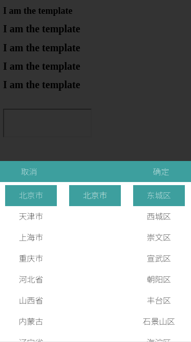

#### 城市选择插件(有待完善)
- html
```
<input type="text" id="grab_address"/>
<script>
  // 调用城市选择插件
  provinceCityCounty({
      boolean: true, // 是否显示县区
      target_id: "grab_address", //事件目标
      element_id: "grab_address", // 放置文本节点
    　callback: function() {
      　// 该回调函数用于target_id目标事件的回调
     　 document.getElementById("grab_address").blur();
    　}
  });
</script>
```
- css(样式需要基于自身的页面rem转换比例调整)
```
<link rel="stylesheet" type="text/css" href="/stylesheets/citySelector.css" />
```
- js
```
<script type="text/javascript" src="/javascripts/citySeletor.js"></script>
```
- 实际效果

